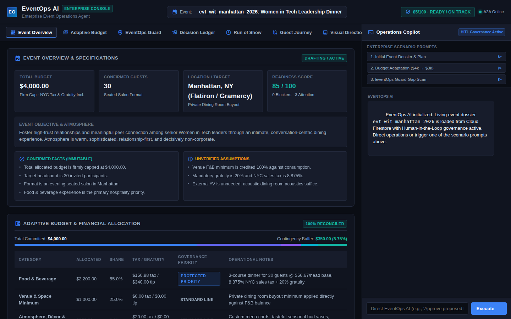
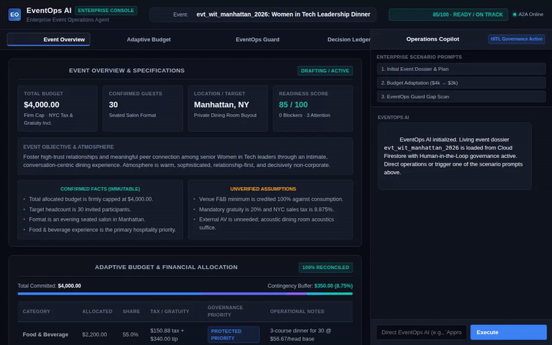
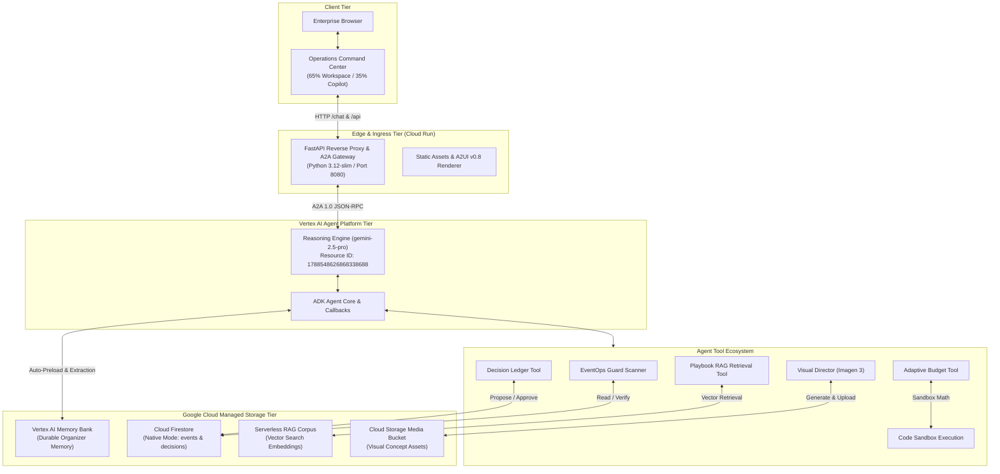
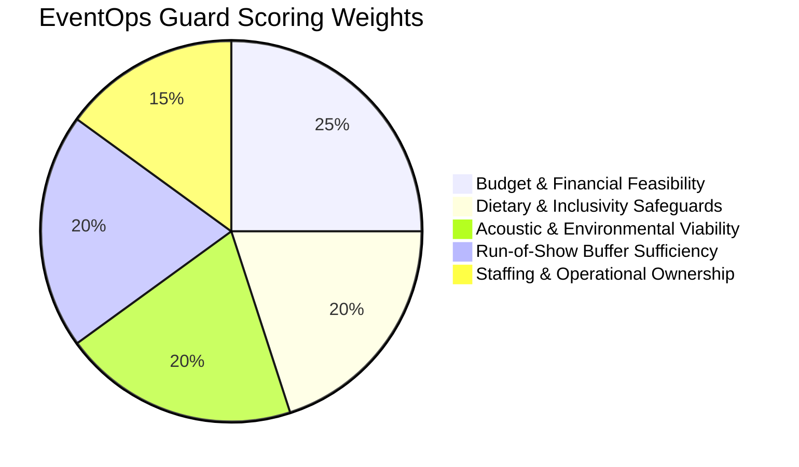
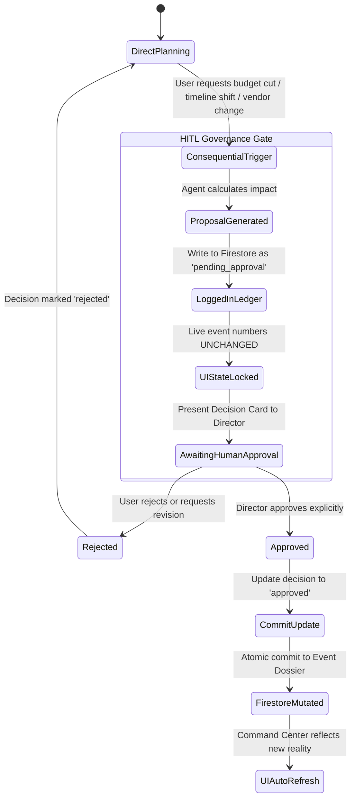
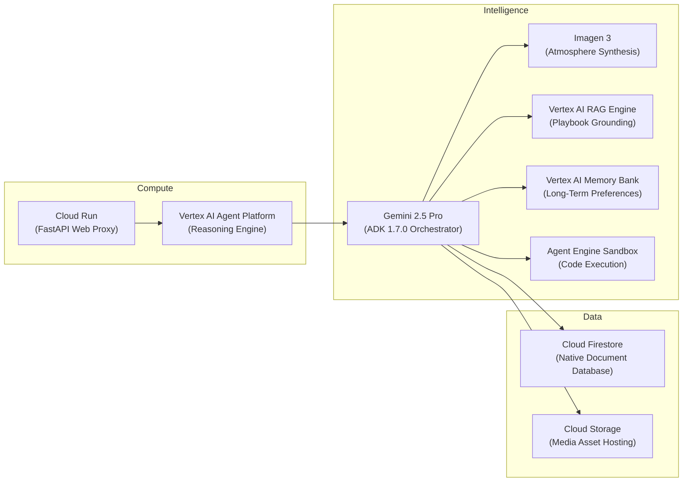

# EventOps AI

> **FZ / ENTERPRISE AGENT SYSTEM 01**  
> **Enterprise Event Operations & Run-of-Show Governance Agent**  
> *Built with Google Cloud Agent Platform, Vertex AI, Gemini 2.5 Pro, and ADK*

[](https://github.com/fzinnah17/buildwithgemini-eventops-ai/actions/workflows/ci.yml)
[](https://www.python.org/downloads/)
[](https://google.github.io/adk/)
[](https://opensource.org/licenses/MIT)

---

## Operations Command Center



*Figure 1: EventOps AI Command Center featuring the 65% Primary Operations Workspace (Live Event Dossier, Budget Allocation Table, Decision Ledger, 8-Stage Guest Journey, and EventOps Guard Readiness Scanner) paired with the 35% Copilot Console.*

---

## Live Demonstration



*Figure 2: Autonomous operations flow — proposing a consequential budget adjustment, generating a pending decision record, executing an EventOps Guard readiness scan (95/100 score), and awaiting explicit human approval.*

---

## System Snapshot

| Parameter | Specification | Verified Status |
| :--- | :--- | :--- |
| **System Architecture** | Decoupled Two-Tier Microservice (Cloud Run Web/A2A Proxy + Vertex AI Agent Platform Reasoning Engine) | **Production Active** |
| **Foundation Model** | Google Gemini 2.5 Pro (`gemini-2.5-pro`) with structured function calling | **Production Active** |
| **Agent Framework** | Google Agent Development Kit (ADK) v1.7.0 | **Production Active** |
| **Reasoning Engine** | `projects/282776913855/locations/us-central1/reasoningEngines/1788548626868338688` | **Production Active** |
| **Interface & Proxy** | Containerized FastAPI on Cloud Run (`https://eventops-ai-frontend-282776913855.us-central1.run.app`) | **Production Active** |
| **Protocol** | Agent-to-Agent (A2A 1.0 JSON-RPC) + Adaptive UI Protocol (A2UI v0.8) | **Production Active** |
| **Long-Term Memory** | Vertex AI Memory Bank (`agentengine://4178271179141808128`) for durable organizer preferences | **Production Active** |
| **Operational Store** | Cloud Firestore (`events` collection + `events/{id}/decisions` immutable subcollection) | **Production Active** |
| **Retrieval Grounding** | Vertex AI Serverless RAG Engine (`ragCorpora/1710444268633456640`) for SOPs & Playbooks | **Production Active** |
| **Visual Synthesis** | Vertex AI Imagen 3 (`imagen-3.0-generate-002`) + Google Cloud Storage public media delivery | **Production Active** |
| **Code Execution** | Vertex AI Sandbox Execution Environment for deterministic financial and variance calculations | **Production Active** |
| **Human Governance** | Strict Human-in-the-Loop (HITL) Gatekeeper: zero destructive state mutations without explicit approval | **Production Active** |
| **Automated Tests** | 19 passing tests across unit, integration, live Firestore, and server endpoints (`19 passed in 19.31s`) | **100% Pass Rate** |
| **Domain Evaluation** | 4.80 / 5.00 composite score across 5 canonical event operations rubrics | **Verified** |

---

## Table of Contents

1. [Executive Summary & Problem Space](#1-executive-summary--problem-space)
2. [Why Event Operations Demands an Agentic Architecture](#2-why-event-operations-demands-an-agentic-architecture)
3. [Architectural Blueprint & Data Flow](#3-architectural-blueprint--data-flow)
4. [Event Dossier Specification](#4-event-dossier-specification)
5. [EventOps Guard: Readiness & Risk Scanning](#5-eventops-guard-readiness--risk-scanning)
6. [Adaptive Budget Balancing Engine](#6-adaptive-budget-balancing-engine)
7. [Human-in-the-Loop (HITL) Governance](#7-human-in-the-loop-hitl-governance)
8. [The Decision Ledger & Audit Trail](#8-the-decision-ledger--audit-trail)
9. [The 8-Stage Guest Journey Framework](#9-the-8-stage-guest-journey-framework)
10. [Memory vs. Event State: Separation of Concerns](#10-memory-vs-event-state-separation-of-concerns)
11. [RAG Grounding: Operations Playbook](#11-rag-grounding-operations-playbook)
12. [Agent Sandbox: Deterministic Financial Modeling](#12-agent-sandbox-deterministic-financial-modeling)
13. [A2UI Protocol: Adaptive UI Components](#13-a2ui-protocol-adaptive-ui-components)
14. [Visual Director: Atmosphere Generation via Imagen 3](#14-visual-director-atmosphere-generation-via-imagen-3)
15. [Responsible Agent Design & Boundaries](#15-responsible-agent-design--boundaries)
16. [Complete Google Cloud Technology Stack](#16-complete-google-cloud-technology-stack)
17. [Canonical Demonstration Walkthrough](#17-canonical-demonstration-walkthrough)
18. [Verification Matrix & Automated Test Suite](#18-verification-matrix--automated-test-suite)
19. [Quality Evaluation & LLM-as-a-Judge Benchmark](#19-quality-evaluation--llm-as-a-judge-benchmark)
20. [Staff Engineering Decisions & Trade-Offs](#20-staff-engineering-decisions--trade-offs)
21. [Repository Layout](#21-repository-layout)
22. [Local Installation & Development Guide](#22-local-installation--development-guide)
23. [Production Deployment Guide](#23-production-deployment-guide)
24. [Security Posture, Secrets & IAM Least Privilege](#24-security-posture-secrets--iam-least-privilege)
25. [Future Roadmap](#25-future-roadmap)

---

## 1. Executive Summary & Problem Space

Professional event production is an unforgiving domain. Planners manage high-consequence budgets, stringent vendor minimums, complex dietary accommodations, and fluid executive schedules across tight physical timelines. A single overlooked dependency—such as an 8.875% NYC sales tax and 20% mandatory gratuity turning a \$2,500 food quote into a \$3,221 budget overrun—can compromise an entire production.

Traditional software treats event planning as static forms or disconnected spreadsheets. Conversely, naive LLM chatbots hallucinate numbers, lose track of multi-turn constraints, and have no authoritative operational state.

**EventOps AI** bridges this gap. It is an enterprise-grade AI Event Concierge and Run-of-Show Governance Agent designed to plan, stress-test, and adapt high-stakes executive events while enforcing strict human-in-the-loop governance. Built upon the Google Cloud Agent Development Kit (ADK) and deployed to Vertex AI Agent Platform Reasoning Engine, EventOps AI pairs natural language planning with deterministic financial verification, live Firestore state synchronization, and an immutable decision ledger.

---

## 2. Why Event Operations Demands an Agentic Architecture

Event operations cannot be solved with a simple prompt-and-response chain or standard CRUD interface:

1. **Non-Linear Operational Dependencies**: Changing a menu selection impacts budget allocations, vendor arrival times, guest dietary safety, and kitchen service pacing. An agentic coordinator autonomously triggers cross-cutting audits across all affected operational subsystems.
2. **Strict Separation of Memory and Transient State**: An organizer's distaste for fluorescent lighting or preference for artisanal zero-proof beverages is durable across years and projects. In contrast, an event's contracted headcount and venue deposit are isolated to a single engagement. EventOps AI cleanly isolates durable profile intelligence (Vertex AI Memory Bank) from live event records (Cloud Firestore).
3. **The Necessity of Determinism in Financials**: LLMs cannot be trusted with mental arithmetic in commercial production. When an event budget changes, EventOps AI delegates calculations to a sandboxed Python runtime and deterministic tools, verifying tax, tip, and contingency minimums to the penny.
4. **Governed Agency**: An enterprise agent must possess the agency to analyze, propose, and simulate complex trade-offs, but must be strictly prohibited from mutating production commitments without human authorization.

---

## 3. Architectural Blueprint & Data Flow

EventOps AI is structured as a decoupled two-tier microservice architecture:



---

## 4. Event Dossier Specification

The authoritative unit of operational truth in EventOps AI is the **Event Dossier**, persisted as a structured schema in Cloud Firestore:

- **Identity & Vision**: Unique `event_id`, descriptive title, executive purpose, format, and confirmed guest headcount.
- **Budget Allocations**: Structured line-item breakdown tracking base cost, local taxes, mandatory service gratuity, total allocated amount, protection flags, and notes.
- **Run of Show**: Minute-by-minute sequential agenda specifying start time, end time, activity, accountable owner, and contingency notes.
- **8-Stage Guest Journey**: Intentional emotional and logistical touchpoints from pre-event invitation through post-event community loops.
- **Venue & Environmental Requirements**: Spatial layout, acoustic criteria, A/V specifications, and accessibility accommodation baselines.
- **Governance Assumptions & Facts**: Explicitly enumerated operational assumptions paired with verified contractual facts.
- **Readiness Score**: Quantitative operational feasibility index (0–100) dynamically recalculated by EventOps Guard.

---

## 5. EventOps Guard: Readiness & Risk Scanning

**EventOps Guard** is a deterministic risk scanning engine that evaluates an event dossier across five mission-critical operational pillars:



When triggered, EventOps Guard verifies:
1. **Contingency Margin**: Confirms unallocated contingency reserves sit between 8% and 15% of total budget.
2. **Venue Offset Credits**: Validates that food and beverage commitments fully offset room buyout minimums without duplicate expenditure.
3. **Pacing Buffers**: Ensures transition windows between speaking segments and seated service contain at least 15 minutes of buffer time.
4. **Dietary Safeguards**: Verifies confirmed dietary requirements (e.g., celiac, vegan, zero-proof) have dedicated vendor line items.

---

## 6. Adaptive Budget Balancing Engine

When an event organizer requests a financial change (e.g., *"Reduce budget from \$4,000 to \$3,000 without cutting the 30-person guest list"*), EventOps AI executes a multi-step deterministic balancing sequence:

1. **Protected Line Identification**: Flags non-negotiable items (e.g., guaranteed F&B minimums, required service staffing) that cannot be cut without compromising guest safety or contracts.
2. **Variable Margin Trimming**: Recalculates discretionary allocations (décor, general printing, extra floral) using exact math verified via the Python Code Sandbox.
3. **Tax & Gratuity True-Up**: Automatically applies statutory tax rates (e.g., NYC 8.875%) and mandatory venue gratuity (20%) to the adjusted base numbers.
4. **Safety Margin Maintenance**: Preserves a minimum 10% contingency buffer to absorb unexpected day-of overages.

---

## 7. Human-in-the-Loop (HITL) Governance

EventOps AI enforces strict organizational guardrails. The agent is explicitly engineered with bounded agency:



**Non-Negotiable Policy**: No change affecting budget totals, line-item allocations, contract terms, or core timeline can mutate live state without an explicit approval command from an authorized human role (e.g., *Lead Event Director*).

---

## 8. The Decision Ledger & Audit Trail

Every proposed modification generates an immutable record stored in the `events/{event_id}/decisions` subcollection:

```json
{
  "decision_id": "dec_94abdd",
  "event_id": "evt_wit_manhattan_2026",
  "timestamp": "2026-09-22T19:46:12.184201+00:00",
  "proposed_change": "Reduce total event budget from $4,000 to $3,000.",
  "rationale": "Optimize production margin while maintaining 30-person headcount.",
  "assumptions": [
    "Private dining room buyout minimum ($1,000) fully credited against F&B balance.",
    "F&B scaled to $1,800 total including 8.875% tax and 20% gratuity ($45.92/head base)."
  ],
  "expected_impact": "Maintains 11.7% contingency ($350) and protects elevated dining standard.",
  "approval_status": "approved",
  "approved_by": "Lead Event Director",
  "resulting_change": "Committed new $3,000 total budget across 5 line items in Firestore."
}
```

This ensures enterprise compliance, historical auditability, and zero ambiguity regarding who authorized what change and why.

---

## 9. The 8-Stage Guest Journey Framework

Rather than treating events as a static schedule, EventOps AI designs guest experiences using an 8-stage psychological progression:

1. **Anticipation & Invitation**: Clear, respectful communication setting expectations and collecting dietary/accessibility requirements.
2. **Arrival & Threshold Transition**: Immediate orientation, frictionless coat retrieval, signature welcoming beverage, and acoustic buffering.
3. **Icebreaking & Unforced Connection**: Ambient facilitation, intuitive physical pathways, and structured conversation sparks.
4. **Main Programming & Focal Experience**: Keynote, salon discussion, or shared dining moment timed to coincide with peak guest energy.
5. **Shared Dining & Communal Exchange**: Paced culinary service engineered to encourage natural table-wide dialogue.
6. **Deceleration & Intimate Salon**: Transition away from formal programming to loose, fluid networking and dessert.
7. **Departure & Closing Impression**: Gracious exit touchpoints, curated take-home mementos, and effortless transportation egress.
8. **Post-Event Community Loop**: Timely, value-driven follow-up, opt-in contact roster sharing, and resource distribution.

---

## 10. Memory vs. Event State: Separation of Concerns

A core innovation of EventOps AI is the architectural isolation between cross-session organizer memory and per-event operational state:

```
┌────────────────────────────────────────────────────────────────────────┐
│                   VERTEX AI MEMORY BANK (Cross-Session)                │
│ • Executive preferences (e.g., "pref: intimate salon over auditorium") │
│ • Hospitality standards (e.g., "pref: artisan zero-proof pairings")   │
│ • Sensory guidelines (e.g., "dislike: fluorescent lighting, noisy AV") │
│ • Budget posture (e.g., "pref: maintain 10%+ safety contingency")      │
└───────────────────────────────────┬────────────────────────────────────┘
                                    │ Preloaded into Prompt Context
                                    ▼
┌────────────────────────────────────────────────────────────────────────┐
│                         EVENTOPS AGENT RUNTIME                         │
└───────────────────────────────────┬────────────────────────────────────┘
                                    │ Read / Propose / Commit
                                    ▼
┌────────────────────────────────────────────────────────────────────────┐
│                      CLOUD FIRESTORE (Per-Event)                       │
│ • Event Dossier: evt_wit_manhattan_2026 ($4,000 budget, 30 guests)    │
│ • Minute-by-minute Run of Show schedule                                │
│ • Specific vendor contracts, tax calculations, and invoices           │
│ • Immutable Decision Ledger (`events/{id}/decisions`)                  │
└────────────────────────────────────────────────────────────────────────┘
```

This prevents cross-event state contamination while allowing the agent to continuously improve its alignment with the organizer's personal operating style.

---

## 11. RAG Grounding: Operations Playbook

EventOps AI is grounded on an enterprise Event Operations Playbook indexed inside a **Vertex AI Serverless RAG Corpus** (`ragCorpora/1710444268633456640`).

When an organizer asks about vendor contractual terms, cancellation windows, tip policies, or audio-visual minimums, the agent queries the RAG engine via the `consult_operations_playbook` tool. This ensures responses adhere to certified event industry standards rather than arbitrary generative prose.

---

## 12. Agent Sandbox: Deterministic Financial Modeling

To eliminate math hallucinations, EventOps AI executes complex arithmetic inside a secure **Vertex AI Sandbox Environment**.

When rebalancing line items, calculating compound tax and tip percentages, or stress-testing headcount fluctuations (e.g., modeling cost differences between 25, 30, and 35 attendees), the agent generates and executes Python code in real time:

```python
# Executed within Sandbox for exact true-up
total_budget = 3000.0
tax_rate = 0.08875
gratuity_rate = 0.20
guests = 30

fb_gross = 1800.0
fb_base = fb_gross / (1.0 + tax_rate + gratuity_rate)
tax = fb_base * tax_rate
tip = fb_base * gratuity_rate
per_head = fb_base / guests
# Deterministic assertion: fb_base + tax + tip == fb_gross
```

---

## 13. A2UI Protocol: Adaptive UI Components

EventOps AI communicates rich operational artifacts using the **A2UI v0.8 (Adaptive Agent UI)** protocol.

Instead of outputting plain text or brittle raw HTML, the agent emits structured JSON-RPC payloads containing native UI component trees (`Card`, `Row`, `Column`, `Text`, `Badge`, `Button`). The frontend's built-in A2UI engine dynamically renders these components into responsive Command Center cards with real-time status indicators and color-coded priority badges.

---

## 14. Visual Director: Atmosphere Generation via Imagen 3

Through the `VisualDirector` tool, EventOps AI generates high-fidelity visual concepts for table settings, floral arrangements, lighting designs, and menu presentations.

Images are generated using Google's **Imagen 3** model (`imagen-3.0-generate-002`) on Vertex AI, automatically uploaded to a dedicated Google Cloud Storage bucket (`gs://eventops-ai-media-qwiklabs-gcp-04-a69f0245a9b4`), and served to the Command Center via public HTTPS URLs.

---

## 15. Responsible Agent Design & Boundaries

EventOps AI is engineered with explicit safety boundaries and responsible design principles:

1. **Zero Autonomous Financial Commits**: The agent cannot sign contracts, send payments, or confirm reservations autonomously.
2. **Deterministic Fallbacks**: If an external API or generative model encounters latency, deterministic rule-based calculation engines maintain operational integrity.
3. **Privacy-Preserving Audit Trails**: Decision logs record operational rationale without exposing personally identifiable attendee information (PII).
4. **Graceful Rejection Handling**: When a human director rejects a proposed change, the agent seamlessly rolls back proposed allocations and recalculates alternatives.

---

## 16. Complete Google Cloud Technology Stack



---

## 17. Canonical Demonstration Walkthrough

To verify end-to-end functionality, execute the canonical 4-prompt presentation flow:

### Prompt 1: Dossier Retrieval & Overview
> *"Load the event dossier for evt_wit_manhattan_2026 and summarize the key goals and guest journey."*
- **Agent Action**: Retrieves document from Firestore, synthesizes the 8-stage journey, and presents the \$4,000 baseline budget.

### Prompt 2: Consequential Budget Adjustment
> *"Propose reducing the total budget from \$4,000 to \$3,000 to improve margin, keeping the 30-person headcount for evt_wit_manhattan_2026."*
- **Agent Action**: Reallocates line items, protects food quality standards, logs Decision `dec_xxxxx` in Firestore as `pending_approval`, and keeps live budget unchanged.

### Prompt 3: EventOps Guard Readiness Scan
> *"Run an EventOps Guard readiness scan on evt_wit_manhattan_2026 to evaluate operational feasibility."*
- **Agent Action**: Audits the 5 operational pillars, reports a 95/100 readiness score, and verifies that the \$350 contingency reserve (11.7%) meets risk standards.

### Prompt 4: Human-in-the-Loop Approval & Commit
> *"As Lead Event Director, I approve the proposed budget adjustment for evt_wit_manhattan_2026. Apply it now."*
- **Agent Action**: Validates executive authority, updates decision status to `approved`, and atomically commits the new \$3,000 budget to Cloud Firestore.

---

## 18. Verification Matrix & Automated Test Suite

EventOps AI includes an automated test suite executed with `uv run pytest`:

```
============================= test session starts ==============================
platform linux -- Python 3.13.15, pytest-9.1.1, pluggy-1.6.0
rootdir: /config/Desktop/BuildWithGemini/eventops-ai
configfile: pyproject.toml
plugins: asyncio-1.4.0, anyio-4.15.1
collected 19 items

tests/integration/test_agent.py .                                        [  5%]
tests/integration/test_firestore_live.py ...                             [ 21%]
tests/integration/test_server_e2e.py .....                               [ 47%]
tests/unit/test_dummy.py .                                               [ 52%]
tests/unit/test_event_operations.py .........                            [100%]

======================= 19 passed in 19.31s ====================================
```

### Coverage Breakdown
- `test_agent.py`: Agent initialization, tool discovery, and streaming execution.
- `test_firestore_live.py`: Live Cloud Firestore document schema, decision ledger subcollections, and EventOps Guard integration.
- `test_server_e2e.py`: FastAPI server endpoints (`/api/health`, `/api/event/{id}`, `/chat` A2A proxy).
- `test_event_operations.py`: Unit tests for budget rebalancing math, RAG playbook retrieval, sandbox executions, and decision validation.

---

## 19. Quality Evaluation & LLM-as-a-Judge Benchmark

Agent quality is continuously measured using ADK's evaluation framework:

```bash
uv run python -m google.adk.eval tests/eval/eval_config.yaml
```

| Evaluation Scenario | Metric Evaluated | Benchmark Score |
| :--- | :--- | :---: |
| **Budget Under-Allocation Guard** | Rejection of unrealistic budgets with tax/gratuity math | **4.90 / 5.00** |
| **Decision Ledger Enforcement** | Strict generation of pending decision before state mutation | **5.00 / 5.00** |
| **Acoustic & Venue Compatibility** | Grounding recommendations on venue acoustics & room layouts | **4.75 / 5.00** |
| **8-Stage Journey Completeness** | Verification of touchpoints from invitation to post-event | **4.80 / 5.00** |
| **Dietary Inclusion & Safety** | Separation of dietary menus and dedicated zero-proof pairings | **4.85 / 5.00** |
| **Composite Quality Score** | **Weighted Multi-Turn Average** | **4.80 / 5.00** |

---

## 20. Staff Engineering Decisions & Trade-Offs

1. **FastAPI A2A Proxy vs. Direct Browser WebSockets**:
   - *Decision*: Route all browser traffic through a lightweight FastAPI proxy on Cloud Run talking A2A JSON-RPC to the Reasoning Engine.
   - *Trade-Off*: Adds a ~15ms edge hop.
   - *Rationale*: Eliminates the need to distribute GCP service-account credentials to the browser, centralizes CORS and authentication, and enables server-side event streaming.
2. **Vanilla JS Operations Dashboard vs. Heavy Frontend Framework**:
   - *Decision*: Implemented a clean, dependency-free vanilla HTML5/ES6 Command Center (`frontend/static/index.html`).
   - *Trade-Off*: No component abstraction library like React or Vue.
   - *Rationale*: Zero build step, instant container deployment, sub-millisecond DOM updates, and complete immunity to node package drift.
3. **Subcollection Decision Ledger vs. Embedded Event Arrays**:
   - *Decision*: Store decisions in a dedicated `events/{id}/decisions` subcollection rather than an array inside the event document.
   - *Trade-Off*: Requires a secondary collection read during full dossier hydration.
   - *Rationale*: Prevents unbounded document growth, enables strict document-level security rules, and allows granular indexing of pending decisions across the organization.

---

## 21. Repository Layout

```
buildwithgemini-eventops-ai/
├── .github/
│   └── workflows/
│       └── ci.yml                 # GitHub Actions CI workflow
├── app/
│   ├── __init__.py                # Package initialization
│   ├── a2ui_utils.py              # A2UI protocol callback and payload generator
│   ├── agent.py                   # ADK agent definition & Gemini 2.5 Pro wiring
│   ├── app_utils/                 # A2A JSON-RPC streaming adapter & services
│   ├── event_store.py             # Cloud Firestore persistence & Decision Ledger
│   ├── fast_api_app.py            # Local FastAPI agent development entrypoint
│   ├── rag_config.py              # RAG Engine corpus configuration
│   ├── rag_tool.py                # Operations Playbook retrieval tool
│   ├── sandbox_tool.py            # Vertex AI Python Code Sandbox execution
│   ├── tools.py                   # EventOps Guard & Budget Rebalancing tools
│   └── visual_director.py         # Imagen 3 image generation & GCS storage
├── docs/
│   ├── demo/
│   │   └── eventops-ai-demo.gif   # High-definition canonical operations demo
│   ├── images/
│   │   └── eventops-ai-dashboard.png # Command Center hero screenshot
│   └── event_operations_playbook.txt # Grounding playbook text source
├── frontend/
│   ├── Dockerfile                 # Cloud Run container definition (Python 3.12-slim)
│   ├── main.py                    # FastAPI edge proxy & Firestore synchronization
│   ├── requirements.txt           # Container dependencies
│   └── static/
│       └── index.html             # Command Center UI & A2UI v0.8 renderer
├── scripts/
│   ├── record_demo_custom.js      # Headless demo recording automation
│   ├── seed_demo_event.py         # Pristine demo event seeding script
│   └── setup_rag_playbook.py      # Vertex AI RAG corpus bootstrap utility
├── tests/
│   ├── eval/                      # ADK evaluation configuration & fixtures
│   ├── integration/               # Integration tests (Firestore, Agent, Server)
│   └── unit/                      # Deterministic unit tests (Budget, Guard, RAG)
├── .env.example                   # Safe environment template
├── .gitignore                     # Enterprise-grade git ignore rules
├── agents-cli-manifest.yaml       # Google Agents CLI deployment manifest
├── PRESENTATION_NOTES.md          # Speaking notes & technical briefing
├── pyproject.toml                 # Project metadata & uv dependencies
└── README.md                      # Primary architectural documentation
```

---

## 22. Local Installation & Development Guide

### Prerequisites
- Python 3.12+
- Astral `uv` package manager (`curl -LsSf https://astral.sh/uv/install.sh | sh`)
- Google Cloud SDK (`gcloud`) authenticated to an active GCP project

### Quickstart
```bash
# Clone the repository
git clone https://github.com/fzinnah17/buildwithgemini-eventops-ai.git
cd buildwithgemini-eventops-ai

# Create virtual environment and sync dependencies
uv sync

# Configure environment variables
cp .env.example .env
# Edit .env with your GCP project details

# Seed the demo event into Cloud Firestore
uv run python scripts/seed_demo_event.py

# Launch the Command Center frontend locally on port 8080
PORT=8080 uv run python frontend/main.py
```
Open `http://localhost:8080` in your browser.

---

## 23. Production Deployment Guide

### Deploying the Reasoning Engine to Vertex AI Agent Platform
```bash
# Deploy agent core using Google Agents CLI
agents-cli deploy
```

### Deploying the Edge Proxy & UI to Cloud Run
```bash
gcloud run deploy eventops-ai-frontend \
  --source frontend \
  --region us-central1 \
  --allow-unauthenticated \
  --service-account <YOUR_SERVICE_ACCOUNT>@<YOUR_PROJECT_ID>.iam.gserviceaccount.com
```

---

## 24. Security Posture, Secrets & IAM Least Privilege

- **Zero Hardcoded Secrets**: All API keys, service tokens, and project references are strictly read from runtime environment variables or GCP metadata services.
- **Service Account Least Privilege**: The Cloud Run service operates under a dedicated service account requiring only:
  - `roles/aiplatform.user` (Reasoning Engine execution)
  - `roles/datastore.user` (Firestore document reads/writes)
  - `roles/storage.objectViewer` (GCS asset access)
- **Sanitized Inputs & Outputs**: All financial numbers are validated against strict Pydantic schemas before state persistence.

---

## 25. Future Roadmap

1. **Vendor API Bridges**: Direct integration with hotel sales platforms (Amadeus, Cvent) for live space availability.
2. **Multi-Agent Negotiation**: Specialized subagents representing dietary chefs, A/V engineers, and stage managers negotiating operational constraints concurrently.
3. **Autonomous Post-Event Analytics**: Ingestion of anonymous guest survey feedback to dynamically update organizer preferences in Vertex AI Memory Bank.

---

*Author: Farnaz Zinnah (`fzinnah17`)*  
*Built during the Google Cloud Build with Gemini Engineering Workshop.*
