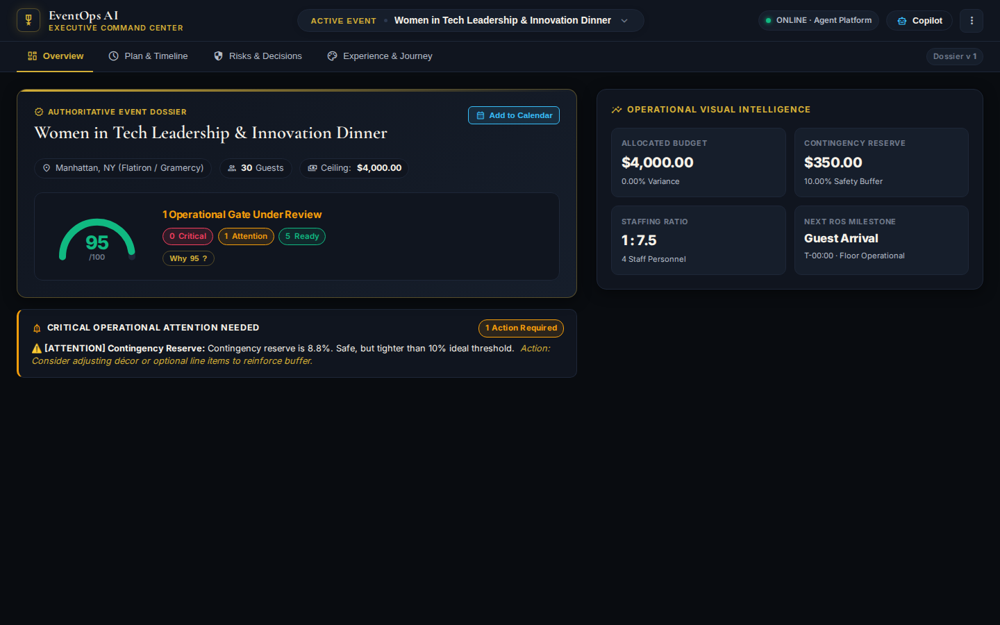
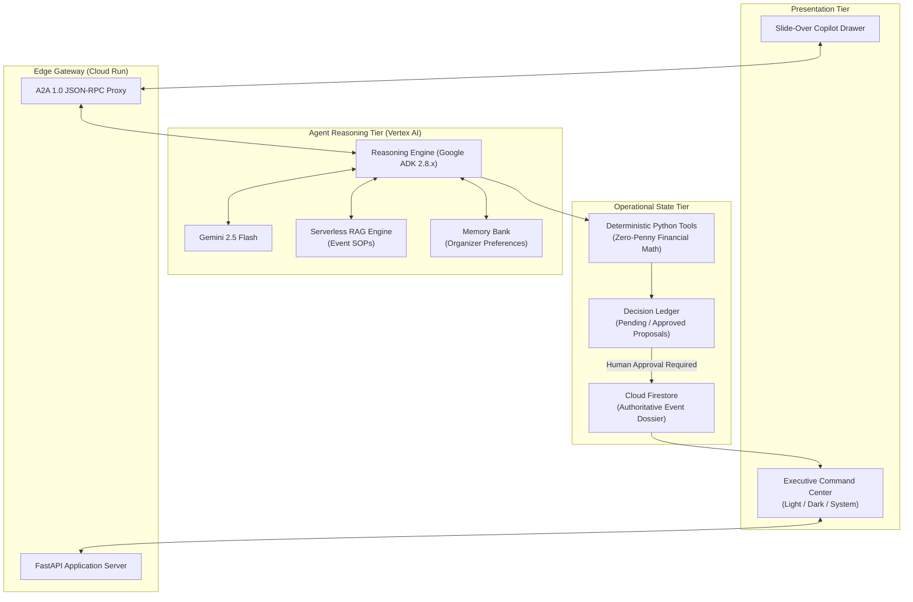

# EventOps AI

An AI event-operations workspace that helps plan an event, catch what is missing, adapt when things change, and keep important decisions with the human organizer.

[Permanent Demo](https://fzinnah17.github.io/buildwithgemini-eventops-ai/) · [Demo Video](https://github.com/fzinnah17/buildwithgemini-eventops-ai/blob/main/docs/demo/eventops-ai-final-demo.mp4) · [GitHub Release](https://github.com/fzinnah17/buildwithgemini-eventops-ai/releases/tag/v1.0.0) · [Live Cloud Run](https://eventops-ai-frontend-282776913855.us-central1.run.app)

[](https://github.com/fzinnah17/buildwithgemini-eventops-ai/actions/workflows/ci.yml)
[](https://github.com/fzinnah17/buildwithgemini-eventops-ai)
[](https://github.com/fzinnah17/buildwithgemini-eventops-ai/releases/tag/v1.0.0)



---

## Why I built it

I started EventOps AI during the **Google Cloud Build with Gemini** engineering workshop.

The project came out of two things I care about: software architecture and event organizing.

Anyone who has organized an event knows that planning gets messy surprisingly quickly. A small change to guest count doesn't stay in one place—it cascades into the budget, staffing, food orders, schedule buffers, and room flow. In practice, that critical information often ends up scattered across notes, spreadsheets, chat threads, and memory.

I wanted to see what an AI agent could do if it had a single, living view of an entire event. 

At the same time, I had a clear boundary in mind: **I didn't want the agent silently changing a budget, sending an email, or updating a calendar just because it thought that was the right next step.** In real events, mistakes have real financial and contractual consequences. An autonomous system that guesses numbers or commits money without asking is a liability, not an assistant.

That balance—giving the AI deep operational context while keeping final authority with the human organizer—is what became EventOps AI.

---

## The Core Idea

The architectural rule behind EventOps AI is simple:

> **Gemini can reason and propose; deterministic code executes; the organizer stays in control.**

```
Understand → Analyze → Propose → Human Approves → Execute → Record
```

It is easy to look at an AI project and assume it is just another chatbot. But EventOps AI is deliberately structured differently:

1. **Reasoning is separated from execution**: Gemini 2.5 Flash spots tradeoffs and proposes adjustments, while deterministic Python code calculates every dollar, tax, and contingency down to the exact penny.
2. **The event lives outside the conversation**: The chat window is not the database. Active plans, budgets, runs of show, and guest requirements live in Cloud Firestore, independent of the chat session.
3. **Organizer preferences are saved separately from event data**: Through Vertex AI Memory Bank, personal organizer preferences (like quiet acoustics or non-alcoholic pairings) persist across events without mixing with a specific event's invoices.
4. **Standard procedures are grounded with retrieval**: The agent consults indexed operational playbooks through Vertex AI Serverless RAG Engine to check venue rules and safety standards instead of guessing.
5. **Consequential changes require explicit human approval**: Rebalancing a budget or shifting a timeline never mutates the database directly. The agent creates an inspectable proposal card in the decision ledger and waits for an organizer to sign off.

---

## What It Does

The workspace gives organizers a unified operational command center:

- **Overview**: A high-level dashboard showing key metrics, an operational readiness score, and open action items that need attention.
- **Plan & Timeline**: A structured run-of-show schedule covering arrival windows, backstage cues, staffing ratios, and contingency buffers.
- **Risks & Decisions**: A live log of operational risks (such as dietary needs or acoustic spillover) alongside the **Decision Ledger**, where proposed changes wait for review.
- **Experience & Journey**: An 8-stage guest journey mapping every touchpoint from pre-arrival invitations to post-event follow-ups.
- **Copilot**: A slide-over assistant where organizers can ask questions, explore alternative ideas, and stress-test scenarios without cluttering the main workspace.
- **Analytics**: Real-time telemetry tracking operational readiness, budget stability, decision throughput, and error sanitation.

---

## A Real Example

Here is what happens under the hood when an organizer asks:  
*"Help me reduce our $4,000 budget to $3,000 for this 30-person salon."*

1. **Read Current State**: EventOps fetches the live event record from Firestore.
2. **Evaluate Constraints**: Gemini analyzes the reduction request against known constraints—such as a $1,000 venue minimum and mandatory 20% gratuity. It recommends scaling down food and beverage while preserving an 11.7% safety contingency.
3. **Calculate to the Penny**: Python's decimal arithmetic engine calculates the exact line items ($1,000 venue, $1,200 F&B, $350 AV, $100 staff, $350 contingency = $3,000.00) with zero rounding drift.
4. **Stage the Proposal**: The system writes a new proposal card to the Firestore decision ledger with status `Pending Approval`.
5. **Review in the UI**: The organizer sees the proposal in the Command Center, showing the old balance, new balance, underlying assumptions, and reasoning.
6. **Explicit Approval**: The organizer reviews the tradeoffs and clicks `[Approve]`.
7. **Atomic Commit**: Only after receiving the human approval token does the system apply changes to the master event record and increment the version.
8. **Permanent Audit Record**: The decision transitions to `Approved` with author and timestamp, preserving a permanent record of why the change was made.

---

## How It Works

The system is built as a clean, decoupled two-tier architecture:

| Part | What I use it for |
| :--- | :--- |
| **Gemini 2.5 Flash + Google ADK 2.8.x** | Reasoning, constraint evaluation, and tool orchestration |
| **Cloud Firestore** | Current event state and auditable decision records |
| **Vertex AI Memory Bank** | Durable cross-session organizer preferences |
| **Vertex AI Serverless RAG Engine** | Grounded event-operations playbooks and safety checklists |
| **Python Deterministic Tools** | Zero-penny budget math, validation, and state commit guards |
| **FastAPI + Cloud Run** | Containerized web gateway, static asset hosting, and A2A proxy |
| **GitHub Pages** | Permanent, zero-cost interactive client simulation for public review |



---

## Why Human Approval Matters

One design choice I cared about was not pretending that more autonomy is always better. If EventOps thinks the budget should change, it creates a proposal. It doesn't get to make that decision for the organizer.

In a demo, it looks impressive when an AI tool says, *"I noticed you were over budget, so I canceled the photographer and sent an update to your guests."* But in reality, that is a nightmare. The organizer might have already promised that photographer the job, or the client might care more about photography than appetizers.

By keeping consequential decisions gated behind the **Decision Ledger**:
- You can freely brainstorm and test ideas with the copilot without worrying that it will accidentally mutate your live event.
- The agent does the heavy analytical lifting, formats the proposal clearly, and brings it to you for the final call.
- Every approved decision leaves an audit trail so you always know who authorized what and why.

---

## Things I had to debug

Building this during the workshop was a fantastic learning experience, and things broke along the way. Here are three issues I had to troubleshoot:

### 1. Vertex AI returned HTTP 400 on chat requests
- **Problem**: When proxying browser messages to the deployed Reasoning Engine over the Agent-to-Agent (A2A) protocol, the backend responded with HTTP 400 Bad Request.
- **Fix**: The service required an explicit `{"message": {"role": "user", "parts": [...]}}` structure rather than a flat string. I updated the gateway adapter to format the JSON-RPC envelope.
- **Lesson**: Inspect low-level request contracts early and build contract tests against live endpoints.

### 2. Old element IDs caused parts of the UI to stay stuck on "Loading"
- **Problem**: During a visual recomposition pass to improve the layout, the event title and status pill on the main dashboard refused to populate, remaining stuck on "Loading Event Dossier...".
- **Fix**: Traced the browser hydration script and discovered that several DOM selector IDs had been renamed during the HTML refactor, causing the data rendering loop to silently exit on missing elements.
- **Lesson**: Always back UI layout refactors with automated headless browser tests that verify DOM hydration end-to-end.

### 3. A test accidentally modified the demo event and drifted the guest count
- **Problem**: While testing event mutations, our integration test suite ran against the live demo event document without resetting state, causing the headcount of the intimate Manhattan salon to balloon from 30 guests to 135.
- **Fix**: Switched tests to use synthetic `evt_test_*` IDs and added automated cleanup fixtures that leave demo records untouched.
- **Lesson**: Never let automated tests share mutable documents with primary demo fixtures.

---

## Testing & Verification

The project is backed by **49 automated tests** running in CI and locally via `uv run pytest tests/`:

- **Budget Correctness**: Verifies zero-penny variance and correct tax/contingency calculations.
- **Decision Approval**: Asserts that proposals cannot modify event state without an approved decision token.
- **Multi-Event Behavior**: Verifies that distinct events maintain completely separated budgets, staff ratios, and risks.
- **Provider Simulations**: Tests calendar scheduling, email drafting, and Slack notifications using deterministic mock providers that require zero external API keys.
- **Browser Rendering**: Tests client-side rendering, data hydration, and drawer interactions in headless Chromium via Playwright.
- **Test Isolation**: Guarantees test runs use synthetic records without corrupting primary demo events.
- **Theme Behavior**: Confirms client-side Light, Dark, and System theme toggling works seamlessly.

---

## Design

The interface was designed around an aesthetic direction called **Perfect Crown**:

I wanted the workspace to feel like a calm, high-end editorial desk rather than a cluttered developer console. The palette pairs warm Hanji ivory in Light Mode with deep midnight lacquer and antique gold in Dark Mode, alongside an automatic System mode that follows your OS preference. It is built entirely with vanilla CSS custom properties and an inline loader script that prevents layout shift or theme flash on page reload.

---

## Live Deployment vs. Permanent Demo

Because Google Cloud workshop environments are temporary, I created two ways to experience EventOps AI:

1. **Live Workshop Build**: Connected directly to Google Cloud services (Vertex AI Agent Platform, Gemini 2.5 Flash, Cloud Firestore, Memory Bank, and RAG) hosted on Google Cloud Run.
2. **Permanent Portfolio Demo**: A zero-cost, client-side mirror hosted on GitHub Pages. It uses realistic fixtures and deterministic provider simulations so anyone can explore the full user experience, inspect the decision ledger, and test theme switching without requiring cloud credentials or incurring API costs.

---

## Technical Documentation

For deeper architectural dives, test evidence, and workshop notes, explore the `/docs` directory:

- [Portfolio Case Study](docs/PORTFOLIO_CASE_STUDY.md) — Detailed technical architecture, data schemas, and design trade-offs.
- [Presentation & Demo Notes](PRESENTATION_NOTES.md) — Live demo script, elevator pitch, and talking points.

---

## Attribution & License

EventOps AI was created by **Farnaz Zinnah** ([@fzinnah17](https://github.com/fzinnah17)) for the Google Cloud Build with Gemini workshop.

Components derived from Google Agent Development Kit (ADK) templates retain their original Apache 2.0 notices as indicated in individual source headers. Project documentation, frontend design assets, and custom governance tooling are shared for educational and portfolio demonstration purposes.
