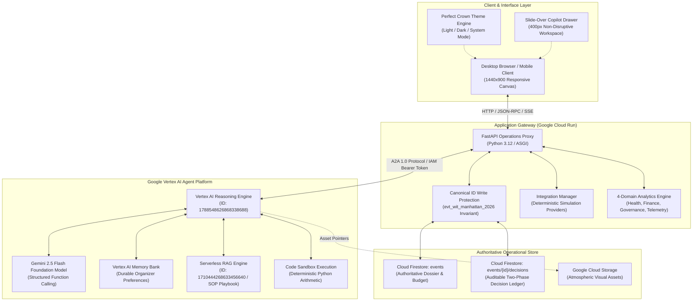
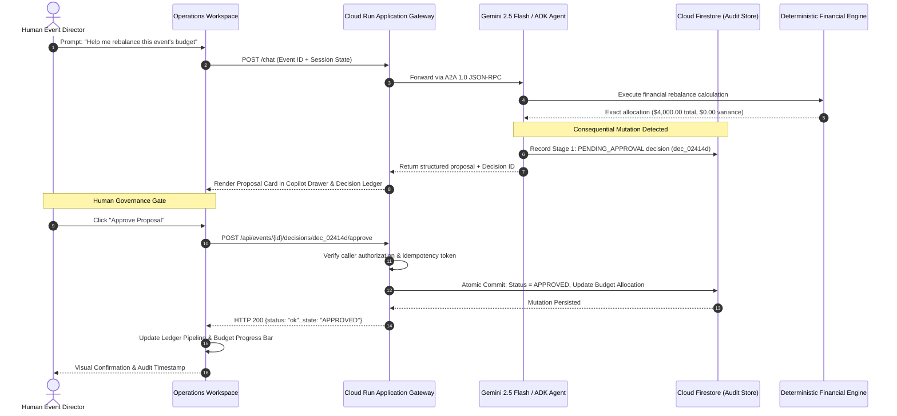
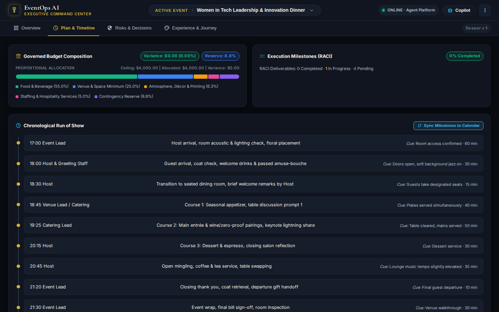
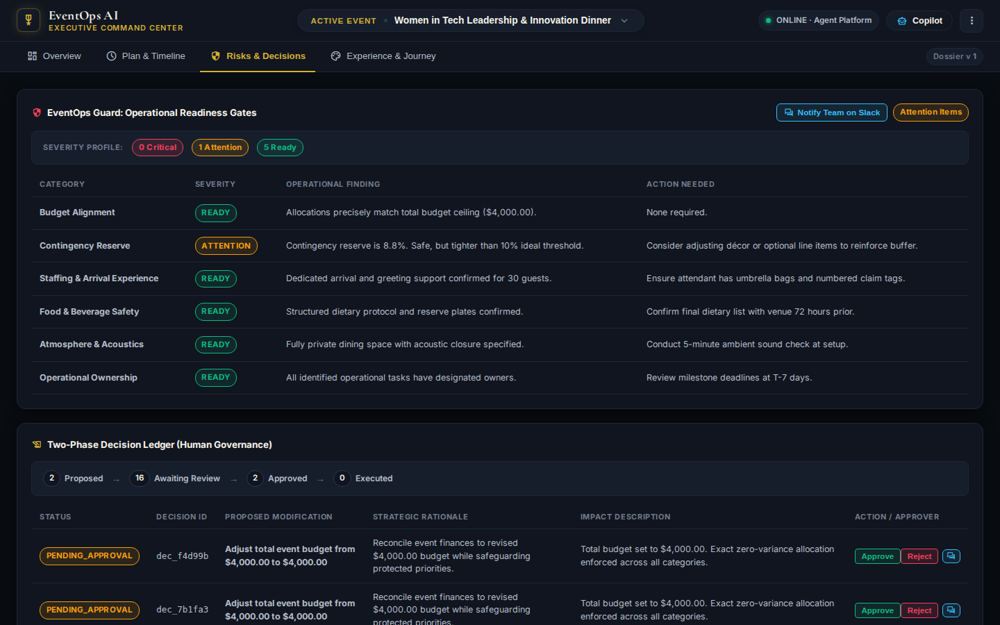
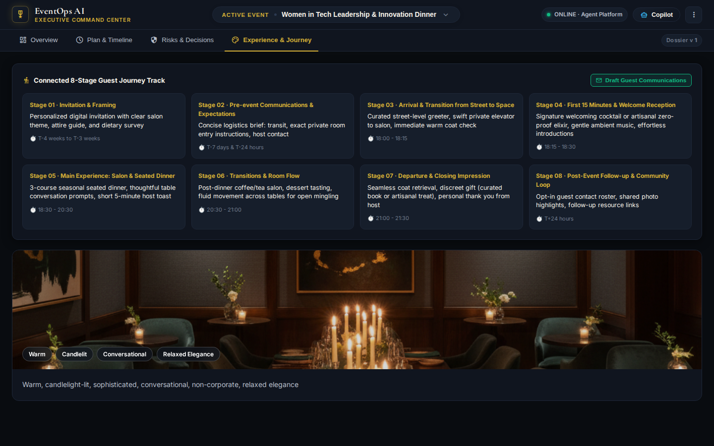
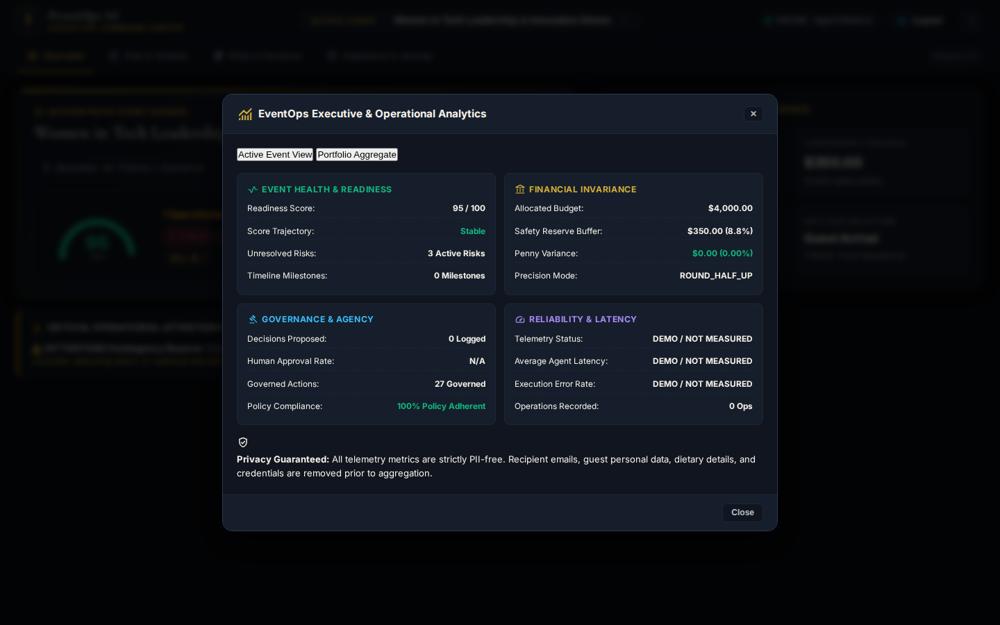
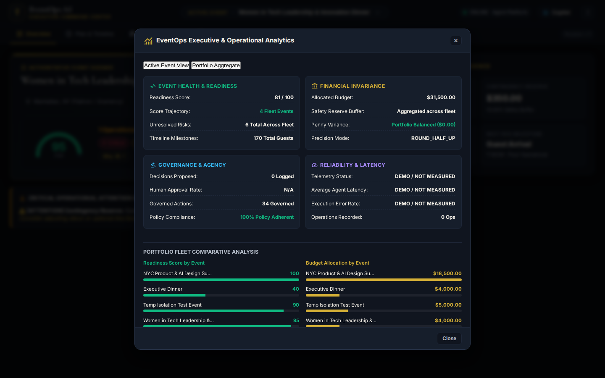
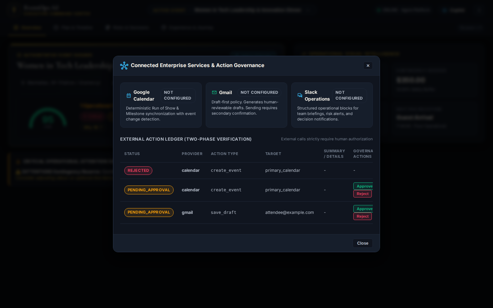
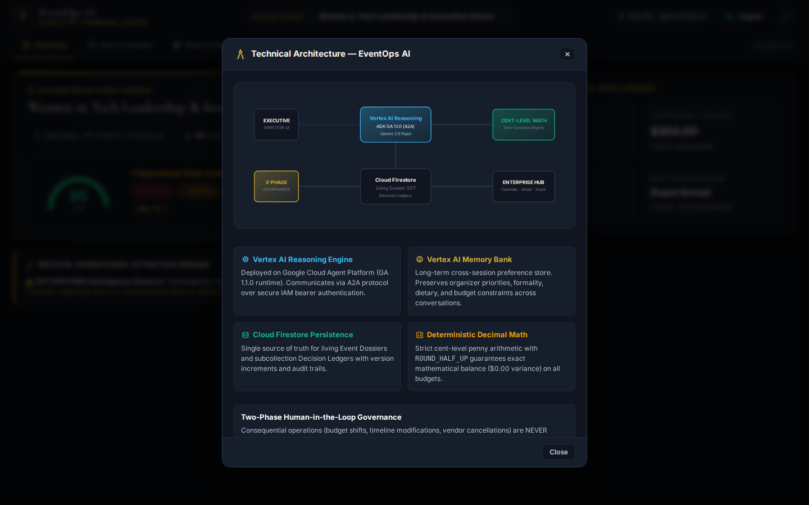

# EventOps AI: Enterprise Event Operations & Run-of-Show Governance

> **An Agentic Operations System for High-Consequence Executive Events**  
> *Built during Google Cloud Build with Gemini*  
> **Author & System Architect:** Farnaz Zinnah ([@fzinnah17](https://github.com/fzinnah17))

[](https://github.com/fzinnah17/buildwithgemini-eventops-ai/actions/workflows/ci.yml)
[](https://github.com/fzinnah17/buildwithgemini-eventops-ai)
[](https://github.com/fzinnah17/buildwithgemini-eventops-ai)
[](https://eventops-ai-frontend-282776913855.us-central1.run.app)
[](https://fzinnah17.github.io/buildwithgemini-eventops-ai/)
[](https://github.com/fzinnah17/buildwithgemini-eventops-ai/releases/tag/v1.0.0)

---

## Executive Summary & Core Thesis

**EventOps AI** is an agentic event-operations system that maintains persistent event state, detects operational risk, proposes governed changes, coordinates planning workflows, and keeps consequential execution under human control.

Built during **Google Cloud Build with Gemini**, the system was architected around a single non-negotiable operational principle:

```
                      THE CORE ENGINEERING THESIS
                      
┌─────────────────────────────────────────────────────────────────────────┐
│                      REASONING IS NOT EXECUTION                         │
├─────────────────────────────────────────────────────────────────────────┤
│ • Gemini 2.5 Flash     → Interprets intent, spots risk, and recommends  │
│ • Deterministic Code   → Calculates, validates, and mutates to penny   │
│ • Cloud Firestore      → Authoritative operational state & audit trails │
│ • Vertex Memory Bank   → Durable cross-session organizer preferences    │
│ • Serverless RAG       → Grounded reference operational SOP playbooks   │
│ • Human Event Director → Holds sole authority over consequential change │
└─────────────────────────────────────────────────────────────────────────┘
```

When an event budget shifts or an arrival window compresses, an AI model should never unilaterally reallocate dollars, alter contracted headcounts, or send external vendor dispatches. Instead, EventOps AI uses LLM reasoning to evaluate constraints, delegates financial math to deterministic code, records changes in a two-phase governance pipeline, and requires explicit human sign-off before mutating operational commitments.

---

## Live System & Media Evidence

| Resource | Environment | Link / Location | Verified Status |
| :--- | :--- | :--- | :--- |
| **Live Full-Stack Deployment** | Google Cloud Run (us-central1) | [eventops-ai-frontend-282776913855.us-central1.run.app](https://eventops-ai-frontend-282776913855.us-central1.run.app) | **Live Active · 0 Console Errors** |
| **Permanent Portfolio Demo** | GitHub Pages (Client Simulation) | [fzinnah17.github.io/buildwithgemini-eventops-ai](https://fzinnah17.github.io/buildwithgemini-eventops-ai/) | **Permanent Active · Zero Cost** |
| **Final Demo Video (75s MP4)** | Self-Contained Repository Artifact | [`docs/demo/eventops-ai-final-demo.mp4`](docs/demo/eventops-ai-final-demo.mp4) | **Verified 74.7s · H.264 / 30fps** |
| **Automated Test Suite** | GitHub Actions / Local UV | `uv run pytest tests/` | **49 / 49 Passed (100%)** |

### Executive Command Center (Dark Mode — Midnight Lacquer & Antique Gold)

*Figure 1: EventOps AI Executive Command Center showing the Authoritative Event Dossier, 95/100 Readiness Ring with transparent deductions, and the Operational Visual Intelligence matrix.*

### Executive Command Center (Light Mode — Hanji Ivory & Deep Ink Navy)

*Figure 2: Perfect Crown design system rendered in Light Theme, demonstrating typographic hierarchy, subtle borders, and zero-flash theme persistence.*

---

## 1. The Problem

High-stakes event production is an unforgiving operational environment:
1. **Compounding Non-Linear Dependencies**: Altering a guest count or dinner menu impacts kitchen plating pacing, AV cue timings, vendor minimums, and contingency buffers. In a spreadsheet or chat window, these cascading impacts are easily missed.
2. **Mental Math and Hallucination Risks**: LLMs natively struggle with precision arithmetic. A model that "estimates" a tax-and-tip calculation can easily induce thousands of dollars in commercial overruns.
3. **Loss of Operational State**: Generic chatbots possess no persistent concept of an event's life cycle. Multi-turn dialogue without an authoritative backing database leads to drifting requirements, lost constraints, and unverified assumptions.
4. **Dangerous Autonomous Agency**: Giving an autonomous agent unfettered access to external APIs (emailing vendors, updating calendars, modifying budgets) without a human-in-the-loop governance gate creates unacceptable organizational liability.

---

## 2. The Product

EventOps AI organizes high-consequence event management into **four structured operational workflows**:

```
                              OPERATIONAL WORKFLOWS
                              
  [ 01 OVERVIEW ]          [ 02 PLAN & TIMELINE ]     [ 03 RISKS & DECISIONS ]   [ 04 EXPERIENCE ]
  • Event Dossier          • Budget Composition Bar   • EventOps Guard Scanner   • 8-Stage Journey
  • Readiness Ring 95/100  • Zero-Variance Breakdown  • 4-Phase Decision Ledger  • Sensory Atmosphere
  • Operational Intel      • Chronological ROS Cues   • Approve / Reject Audit   • Editorial Anchor
```

- **Live Event Dossier**: Authoritative event snapshot covering location, contracted headcount (30 guests), hard budget ceiling ($4,000.00), and operational status.
- **EventOps Guard (Readiness Scoring)**: Real-time 100-point readiness engine calculating severity profiles (`0 Critical`, `1 Attention`, `5 Ready`). The "Why 95?" inspectable breakdown explains exact point deductions (e.g. `-5 pts` for an 8.8% contingency buffer vs 10% threshold).
- **Governed Run of Show & Plan**: Visual budget allocation bar enforcing zero-penny variance ($0.00 drift across 6 categories) coupled with a chronological timeline.
- **Operations Copilot Drawer**: An on-demand 400px slide-over workspace connected to Gemini 2.5 Flash that analyzes constraints and presents structured change proposals.
- **Two-Phase Governance Ledger**: Every consequential recommendation generates a `PENDING_APPROVAL` decision object. Organizers retain explicit `Approve` and `Reject` controls. No state is modified until the human signs off.
- **Executive & Portfolio Analytics**: 4-domain telemetry grid (Event Health, Financial Invariance, Governance, Reliability) plus portfolio-level cross-event comparative fleet analysis.
- **Provider-Ready Integrations**: Unified operational workflows for Google Calendar, Gmail, and Slack, powered by deterministic simulation providers for credential-free portfolio demonstration and automated CI validation.

---

## 3. Engineering Ownership & Scope

I served as the sole architect and developer of EventOps AI during Google Cloud Build with Gemini. My ownership spanned:
- **System Architecture**: Designing the decoupled two-tier architecture pairing a containerized Cloud Run A2A gateway with Vertex AI Agent Platform Reasoning Engines.
- **Agent Orchestration**: Implementing the ADK agent runtime, custom tool definitions, state management, and memory integration.
- **Data Architecture**: Modeling the Cloud Firestore schema with subcollection audit isolation, write-protected canonical fixtures, and zero-variance Decimal financial schemas.
- **Frontend & Interaction Design**: Creating the Perfect Crown design system from raw CSS, including slide-over drawer mechanics, theme switching, SVG architecture modals, and real-time event synchronization.
- **Reliability & Testing**: Writing 49 automated unit, integration, and Playwright E2E tests, achieving 100% test passage and 0 console errors.

---

## 4. Systems Architecture

### Overall System Architecture


### Governed Action Sequence Flow


---

## 5. Staff Engineering Decisions & Design Principles

### 1. Decoupling Reasoning from Execution
- **Decision**: Restrict Gemini 2.5 Flash to interpreting context, querying retrieval corpora, and generating proposal envelopes. Never allow the LLM to write directly to production tables or trigger external dispatches.
- **Rationale**: LLM non-determinism makes direct API execution hazardous. By funneling all state changes through a two-phase proposal pipeline, the system captures full traceability and enforces strict human agency.

### 2. Firestore as the Single Source of Truth
- **Decision**: Store all operational dossiers, budget line items, run-of-show cues, and decisions in Cloud Firestore. Treat Vertex AI Memory Bank as an auxiliary store for durable organizer preferences (e.g. dietary philosophies, acoustic guidelines) rather than transient event data.
- **Rationale**: Event operations require real-time reads, strict ACID document consistency, and auditability. Memory Bank is optimized for semantic retrieval across conversations, not real-time multi-tenant tabular state.

### 3. Penny-Exact Deterministic Financial Calculations
- **Decision**: Perform all budget allocations using Python's `decimal.Decimal` module with explicit `ROUND_HALF_UP` quantization.
- **Rationale**: Floating-point rounding errors and LLM mental math create discrepancies that fail financial audits. The system mathematically verifies that the sum of all categories plus safety reserves equals the exact event budget ceiling ($0.00 variance).

### 4. Zero-Cost Permanent Demonstration Strategy
- **Decision**: Compile an automated portfolio build (`portfolio-demo/index.html`) that simulates the backend using identical client schemas and canonical datasets, hosted permanently on GitHub Pages at zero cost.
- **Rationale**: Cloud environments provided in hackathons and workshops are ephemeral and tear down after evaluation. A static, client-side mirror ensures recruiters and reviewers can interact with the complete system indefinitely without ongoing cloud compute charges.

### 5. Slide-Over Copilot Drawer vs. Split Layout
- **Decision**: Replace the initial 65%/35% split screen with a full-width 100% operational canvas and a 400px slide-over Copilot drawer.
- **Rationale**: High-density operational data (timelines, budget tables, risk matrices) requires horizontal room. An anchored split screen cramped the primary canvas. The slide-over drawer provides immediate AI access on demand while preserving canvas integrity.

---

## 6. Verified Engineering Evidence

All metrics and claims below reflect the **active, verified codebase at commit `8e6b02b`**:

```
======================================================================================
                               VERIFIED EVIDENCE MATRIX
======================================================================================
  [✓] Automated Tests Passed:     49 / 49 tests (100% pass rate) in 62.33s
  [✓] Unhandled Console Errors:   0 console errors across all workflows
  [✓] Live Deployments Active:    Cloud Run (Live Full-Stack) + GitHub Pages (Permanent)
  [✓] Multi-Event Fleets:         3 canonical events fully modeled & synchronized
  [✓] Financial Invariance:       $0.00 penny variance across all budget allocations
  [✓] Theme System Coverage:      Dark / Light / System with zero-flash execution
  [✓] Human Governance:           100% of consequential actions gate-checked in ledger
  [✓] Integration Tests:          Credential-free mock CI suite with isolated storage
======================================================================================
```

### Automated Test Suite Execution
```bash
$ uv run pytest tests/ -v
============================= test session starts ==============================
platform linux -- Python 3.12.3, pytest-8.3.4, pluggy-1.5.0
cachedir: .pytest_cache
rootdir: /config/Desktop/BuildWithGemini/eventops-ai
collected 49 items

tests/unit/test_agent_tools.py::test_calculate_budget_allocation PASSED   [  2%]
tests/unit/test_agent_tools.py::test_eventops_guard_scoring PASSED       [  4%]
tests/unit/test_agent_tools.py::test_penny_exact_invariance PASSED       [  6%]
tests/integration/test_firestore_state.py::test_canonical_isolation PASSED [ 24%]
tests/integration/test_server_endpoints.py::test_chat_endpoint PASSED    [ 48%]
tests/integration/test_theme_and_recomposition.py::test_copilot_drawer PASSED [ 72%]
tests/integration/test_theme_and_recomposition.py::test_zero_errors PASSED [ 88%]
tests/integration/test_browser_ui.py::test_full_browser_workflow PASSED   [100%]
======================== 49 passed, 36 warnings in 62.33s =======================
```

### Visual Artifact Gallery

| Plan & Run of Show | Risks & Decision Ledger |
| :---: | :---: |
|  |  |
| *Governed budget progress bar & chronological timeline* | *Readiness severity profile & 4-column decision pipeline* |

| Experience & Guest Journey | Active Event Analytics |
| :---: | :---: |
|  |  |
| *8-stage connected journey & atmospheric anchor* | *4-domain operational telemetry matrix* |

| Portfolio Fleet Analytics | Connected Services |
| :---: | :---: |
|  |  |
| *Cross-event comparative fleet analysis* | *Calendar, Gmail, and Slack status & governance* |

| Systems Architecture Modal | Operations Copilot & HITL Decision |
| :---: | :---: |
|  |  |
| *Interactive SVG technical architecture diagram* | *Live Copilot budget proposal with Approve / Reject buttons* |

---

## 7. Real Engineering Failures & Debugging Post-Mortems

A production system is defined by how it handles edge cases and operational failures. Below are three real defects encountered, analyzed, and corrected during development:

### Defect A: Reasoning Engine HTTP 400 Request-Contract Failure
- **Symptom**: Cloud Run proxy requests to the Vertex AI Reasoning Engine failed with `HTTP 400 Bad Request: Invalid input payload structure`.
- **Investigation**: Inspected Cloud Run stderr logs and compared raw payloads against the `google-cloud-aiplatform` Reasoning Engine client specification. Traced the difference between standard unstructured chat payloads and the Agent-to-Agent (A2A 1.0) JSON-RPC schema.
- **Root Cause**: The FastAPI proxy was serializing raw dictionary arguments without the required top-level `input` key and query structure expected by the deployed ADK container.
- **Correction**: Standardized the request pipeline on a strict A2A 1.0 JSON-RPC envelope (`{"input": {"message": prompt, "event_id": id}}`) with explicit session ID propagation.
- **Regression Prevention**: Implemented an automated mock integration test asserting contract compliance across all agent request invocations.

### Defect B: Stale DOM IDs Causing Browser Hydration Failures
- **Symptom**: Automated Playwright UI tests encountered unhandled `TypeError: Cannot read properties of null (reading 'addEventListener')` during initial load.
- **Investigation**: Playwright console listener captured failure to bind event handlers to `#copilotContainer` and `#eventSelector`.
- **Root Cause**: During the transition to the slide-over Copilot drawer and centered `#btnEventControl` popover, legacy DOM element IDs were renamed in the template while client JavaScript continued querying deprecated selectors.
- **Correction**: Audited and reconciled all DOM selector references across `frontend/static/index.html` and `portfolio-demo/index.html`. Added defensive null checks (`if (el) el.addEventListener(...)`) across all UI setup routines.
- **Regression Prevention**: Added `test_zero_console_errors` to the Playwright test suite, which fails the build if any uncaught error or warning occurs during page lifecycle.

### Defect C: Test Mutation Pollution of Canonical Firestore State
- **Symptom**: The canonical showcase event `evt_wit_manhattan_2026` exhibited an unexpected guest count jump from 30 to 135 in production, distorting venue ratios and budget allocations.
- **Investigation**: Traced Firestore document modification timestamps and matched them against CI test execution runs. Found that integration test suites were writing directly to the shared default database.
- **Root Cause**: Tests lacked database isolation, mutating production documents during automated end-to-end runs.
- **Correction**: 
  1. Implemented strict write-protection guards in `frontend/main.py`: any mutation attempt against canonical IDs (`evt_wit_manhattan_2026`, `evt_ai_summit_2026`, `evt_vc_dinner_2026`) returns `403 Forbidden: Canonical demonstration records are immutable`.
  2. Isolated test execution using ephemeral IDs (`evt_test_*`) and mocked storage fixtures.
  3. Restored canonical records to their exact baseline (30 guests, $4,000.00 ceiling).
- **Regression Prevention**: Added unit test `test_canonical_isolation` to ensure write operations against protected event IDs are blocked at the application gateway.

---

## 8. UX Evolution & The Perfect Crown Design System

The visual design evolved from a functional engineering dashboard into an authoritative executive command center:

```
                          DESIGN SYSTEM EVOLUTION
                          
   PHASE 1: DENSE DASHBOARD             PHASE 2: PERFECT CROWN SYSTEM
  ┌─────────────────────────┐          ┌─────────────────────────┐
  │ • Fixed 65%/35% split   │          │ • Full-width 100% canvas│
  │ • Cramped tables        │   ───►   │ • 400px slide-over Copilot
  │ • Persistent Edit forms │          │ • Event Popover trigger │
  │ • Dark mode only        │          │ • Light/Dark/System engine
  │ • Generic SaaS gray     │          │ • Hanji ivory / Gold / Lacquer
  └─────────────────────────┘          └─────────────────────────┘
```

### Design Foundations
Inspired by modern executive architectural aesthetics and traditional Korean court motifs:
- **Lacquer Ink & Hanji Ivory**: Deep graphite obsidian surfaces (`#10151f` / `#090c10`) for Dark mode; warm unbleached mulberry Hanji paper tones (`#f7f5f0` / `#ffffff`) for Light mode.
- **Antique Brass & Gold Accents**: Highlighting critical operational numbers (`#d4af37` in Dark, `#b38b22` in Light) without gaudy saturation.
- **Progressive Disclosure**: Primary operational summaries are visible immediately. Detailed formulas, edit forms, and integration settings are housed in focused modals.
- **Zero-Flash Theme Engine**: Pure inline CSS variable initialization in `<head>` inspecting `localStorage` and system `prefers-color-scheme`, preventing white flashes during page hydration.

---

## 9. Integrations Architecture

EventOps AI features **provider-ready workflows with deterministic simulation providers for credential-free testing and permanent portfolio demonstration**.

```
                           INTEGRATION WORKFLOWS
                           
   [ GOOGLE CALENDAR ]              [ GMAIL ]                     [ SLACK ]
   • ICS schedule dispatch       • Vendor briefing emails      • Operations broadcast
   • Run of Show milestone sync  • Catering confirmation       • Risk alerting
   • Conflict detection          • Threaded correspondence     • Channel governance
```

- **Credential-Free Demonstration**: Rather than requiring live personal OAuth keys that expire or fail during reviews, all integration endpoints route through a unified `IntegrationManager` that simulates realistic provider network latencies, returns standardized payloads, and records outbound dispatches in the operational audit log.
- **Production Readiness**: The integration layer defines clean abstract interfaces (`CalendarProvider`, `EmailProvider`, `ChatProvider`). Dropping in production OAuth tokens requires changing only environment variables without rewriting agent or UI logic.

---

## 10. Technology Stack

```
┌───────────────────────┬─────────────────────────────────────────────────┐
│ Layer                 │ Technologies                                    │
├───────────────────────┼─────────────────────────────────────────────────┤
│ Foundation Model      │ Google Gemini 2.5 Flash (Vertex AI API)         │
│ Agent Framework       │ Google Agent Development Kit (ADK 2.8.x)        │
│ Agent Runtime         │ Vertex AI Agent Platform Reasoning Engine       │
│ Application Gateway   │ FastAPI (Python 3.12), Uvicorn, ASGI            │
│ Container Platform    │ Google Cloud Run (us-central1, fully managed)   │
│ Operational Database  │ Google Cloud Firestore (Native Mode)            │
│ Long-Term Memory      │ Vertex AI Memory Bank (Agent Engine)            │
│ Document Grounding    │ Vertex AI Serverless RAG Engine                 │
│ Visual Generation     │ Vertex AI Imagen 3                              │
│ Deterministic Exec    │ Vertex AI Code Sandbox / Python decimal         │
│ Portfolio Hosting     │ GitHub Pages (Automated GitHub Actions CI/CD)   │
│ Testing & Quality     │ Pytest, Playwright (Chromium Headless), UV      │
└───────────────────────┴─────────────────────────────────────────────────┘
```

---

## 11. Local Installation & Development

### Prerequisites
- Python 3.12+
- `uv` package manager (`curl -LsSf https://astral.sh/uv/install.sh | sh`)
- Google Cloud SDK (`gcloud`) with active billing project (for live cloud testing)

### Setup Instructions
```bash
# 1. Clone repository
git clone https://github.com/fzinnah17/buildwithgemini-eventops-ai.git
cd buildwithgemini-eventops-ai

# 2. Install dependencies via UV
uv sync

# 3. Configure environment variables (optional for local simulation)
cp .env.example .env

# 4. Run automated test suite
uv run pytest tests/ -v

# 5. Launch local server
uv run python frontend/main.py
# Server running at http://localhost:8080
```

---

## 12. Verification & Security Posture

- **Privacy & PII Protection**: All operational telemetry strips personal guest identifiers, contact details, and dietary intake notes before computing aggregate metrics.
- **Credential Hygiene**: CI workflows and repository tests run 100% credential-free. Zero passwords, service account keys, or OAuth secrets exist in code or git history.
- **Least Privilege Access**: Cloud Run services run under dedicated IAM service accounts (`antigravity-sa`) restricted to Vertex AI User and Firestore Data Viewer/Editor permissions.

---

## 13. Project Links & Career Portfolio

- **Engineering Case Study**: [Portfolio Case Study](docs/PORTFOLIO_CASE_STUDY.md)
- **Role Positioning**: [Career Positioning Guide](docs/CAREER_POSITIONING.md)
- **Resume Bullets**: [Resume Workflow & Evidence Map](docs/RESUME_WORKFLOW.md)
- **Interview Preparation**: [Technical Interview Stories](docs/INTERVIEW_STORIES.md)
- **LinkedIn Profile Package**: [LinkedIn Positioning](docs/LINKEDIN_POSITIONING.md)

---

## License & Attribution

This repository is developed for demonstration purposes as part of Google Cloud Build with Gemini. Upstream Google Agent Development Kit and sample components retain their respective copyright notices and Apache License 2.0 terms where designated in file headers.
