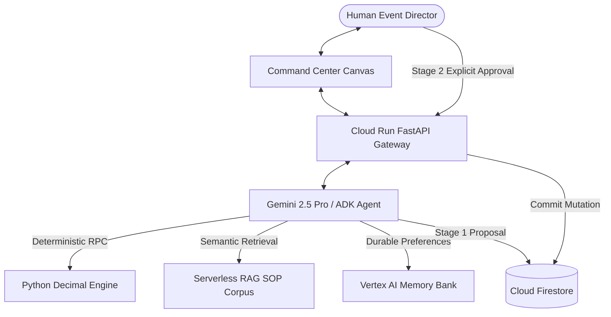
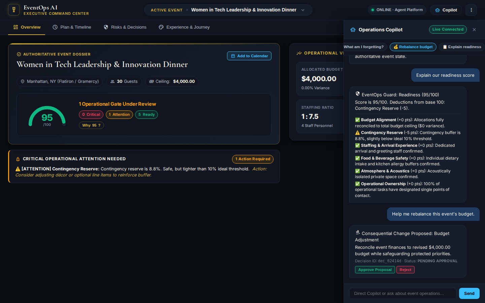
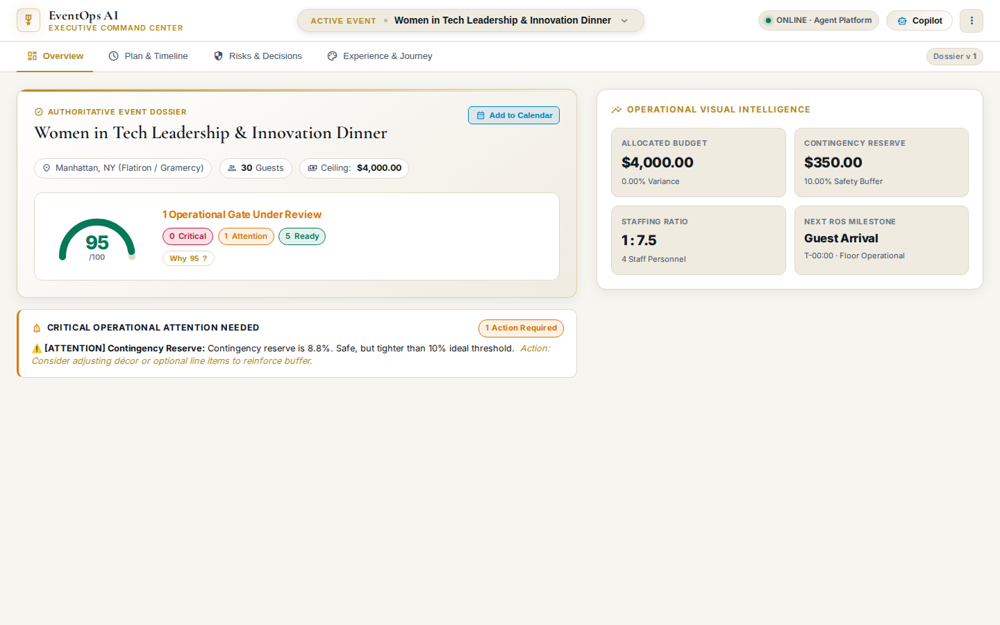

# Case Study: EventOps AI — Governed Agentic Operations

> **Author:** Farnaz Zinnah  
> **Role:** Full-Stack & AI Systems Architect  
> **Timeline:** Built during Google Cloud Build with Gemini (2026)  
> **Live System:** [Cloud Run Application](https://eventops-ai-frontend-282776913855.us-central1.run.app) · [Permanent Demo](https://fzinnah17.github.io/buildwithgemini-eventops-ai/) · [GitHub Repository](https://github.com/fzinnah17/buildwithgemini-eventops-ai)

---

## The Problem

Executive event production is an unforgiving operational domain. A single overlooked dependency—such as an uncalculated 8.875% sales tax and 20% gratuity on a catering contract—can transform an approved \$2,500 dinner quote into an unbudgeted \$3,221 commercial overrun.

Traditional software treats event operations as static spreadsheets or rigid CRUD forms. Conversely, naive AI chatbots hallucinate numbers, lose state across multi-turn sessions, and lack safe boundaries when given autonomous agency.

---

## The Product

**EventOps AI** is an enterprise AI Event Concierge and Run-of-Show Governance Agent. It pairs generative language reasoning with deterministic financial verification, live Cloud Firestore state persistence, and an immutable two-phase decision ledger.

*Figure 1: The EventOps AI Executive Command Center, featuring the Authoritative Event Dossier, 95/100 Readiness Ring with transparent point deductions, and the Operational Visual Intelligence matrix.*

---

## My Role

As sole system architect and engineer, I was responsible for the complete lifecycle:
- Designed the decoupled two-tier architecture (Cloud Run application gateway + Vertex AI Agent Platform Reasoning Engine).
- Authored custom tool definitions with deterministic Python arithmetic and Google ADK.
- Modeled the Cloud Firestore schema with subcollection audit isolation and canonical data write protection.
- Created the **Perfect Crown** design system from raw CSS (Hanji ivory, midnight lacquer, and antique gold) with an on-demand slide-over Copilot drawer.
- Implemented automated verification across 49 unit, integration, and Playwright browser E2E tests.

---

## Architecture: Reasoning is Not Execution

The architectural foundation of EventOps AI is that **reasoning is not execution**:

- **Gemini 2.5 Pro**: Interprets requirements, identifies operational risks, and recommends adjustments.
- **Deterministic Services**: Compute taxes, balances, and contingency buffers with penny precision ($0.00 variance).
- **Cloud Firestore**: Holds authoritative operational records and immutable audit ledgers.
- **Vertex AI Memory Bank**: Preserves durable organizer preferences across multiple engagements.
- **Human Director**: Retains absolute approval authority over consequential changes.

---

## Human-Governed Execution in Action

When an organizer asks Copilot to rebalance a budget:
1. Gemini evaluates the constraints and calls `calculate_budget_allocation` to determine exact category amounts.
2. The agent formats a proposal envelope and writes a `PENDING_APPROVAL` record to Firestore.
3. The UI presents an actionable proposal card with `Approve Proposal` and `Reject` buttons.
4. Only when the human director explicitly clicks Approve does the system commit the budget update.

*Figure 2: Slide-over Operations Copilot drawer presenting a structured budget proposal requiring human sign-off before state mutation.*

---

## Key Engineering Decisions

| Decision | Rationale | Engineering Tradeoff |
| :--- | :--- | :--- |
| **Two-Phase Governance** | Prevent uninspected AI mutations from altering production event commitments. | Adds an explicit human approval step rather than 100% autonomous execution. |
| **Firestore as SOT** | Requires ACID document consistency and real-time client synchronization. | Chose relational document model over pure vector/memory storage for operational data. |
| **Python Decimal Math** | LLMs cannot guarantee exact precision in financial arithmetic. | Required dedicated Python tool execution rather than in-context model arithmetic. |
| **Permanent Client Mirror** | Workshop cloud environments are temporary; recruiters need permanent evaluation access. | Built automated GitHub Pages build that simulates the backend with identical schemas. |
| **Slide-Over Copilot Drawer** | Full-width canvas is essential for high-density timelines and tables. | Replaced 65/35 split view with 400px slide-over drawer to maximize data visibility. |

---

## Real Engineering Failures & Debugging

1. **Reasoning Engine Contract Mismatch (HTTP 400)**:  
   *Problem*: Cloud Run proxy calls failed with HTTP 400 when communicating with Vertex AI.  
   *Fix*: Traced payload differences and standardized on the strict A2A 1.0 JSON-RPC envelope (`{"input": {"message": ...}}`).

2. **Stale DOM Selectors**:  
   *Problem*: Browser tests threw null pointer exceptions during hydration after UI recomposition.  
   *Fix*: Audited all DOM IDs, added defensive checks, and implemented automated Playwright tests asserting 0 unhandled console errors.

3. **Test Mutation of Production State**:  
   *Problem*: Automated test runs mutated the canonical Women in Tech dinner headcount from 30 to 135 in production.  
   *Fix*: Enforced application-level write protection on canonical IDs (`evt_wit_manhattan_2026`) and isolated test execution to mock fixtures.

---

## Design Evolution: The Perfect Crown System

The user interface evolved from a dense engineering dashboard into an authoritative executive command center:

| Theme | Inspiration | Surfaces & Accents |
| :--- | :--- | :--- |
| **Dark Theme** | Midnight Ink Lacquer | `#090c10` canvas, `#10151f` graphite cards, `#d4af37` antique gold accents |
| **Light Theme** | Hanji Mulberry Paper | `#f7f5f0` ivory canvas, `#ffffff` warm white cards, `#b38b22` brass accents |

The layout features an asymmetric 58%/42% overview, progressive disclosure modals for deep technical telemetry, and a zero-flash inline theme initializer.

*Figure 3: Perfect Crown design system rendered in Light Theme, demonstrating typographic hierarchy and subtle border treatments.*

---

## Verified Results

- **49 / 49 Automated Tests Passing**: Comprehensive suite covering unit, integration, and E2E browser workflows.
- **Zero Console Errors**: Verified across all 4 workflows in both Dark and Light themes.
- **Zero-Penny Invariance**: Enforced $0.00 drift across all allocated event budgets.
- **Dual Deployment**: Deployed on Google Cloud Run and mirrored permanently on GitHub Pages.

---

## What I Learned

1. **Agent boundaries must be architectural, not conversational**: Prompt instructions ("Please do not change the budget") will eventually fail. Only transactional gates in software can guarantee compliance.
2. **State separation is critical**: Mixing long-term preferences, active event records, and reference documents into a single store degrades performance and consistency.
3. **Deterministic tools make agents viable**: Pairing an LLM's natural language understanding with deterministic code execution yields a reliable, auditable system.

---

## Next Steps

- **Enterprise Role-Based Access Control (RBAC)**: Support tiered approvals where department heads approve budgets above \$10,000.
- **Live Google Workspace OAuth**: Transition provider-ready Calendar and Gmail workflows to live multi-tenant OAuth 2.0.
- **Real-Time WebSockets**: Stream run-of-show updates to on-site production teams via bi-directional WebSockets.

---

## Project Artifacts

- **Full Demo Video (75s)**: [`docs/demo/eventops-ai-final-demo.mp4`](demo/eventops-ai-final-demo.mp4)
- **Code Repository**: [github.com/fzinnah17/buildwithgemini-eventops-ai](https://github.com/fzinnah17/buildwithgemini-eventops-ai)
- **Live Cloud Run System**: [eventops-ai-frontend-282776913855.us-central1.run.app](https://eventops-ai-frontend-282776913855.us-central1.run.app)
- **Permanent Demo**: [fzinnah17.github.io/buildwithgemini-eventops-ai](https://fzinnah17.github.io/buildwithgemini-eventops-ai/)
